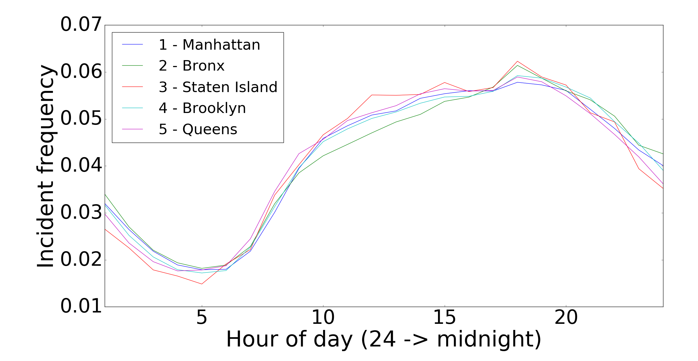
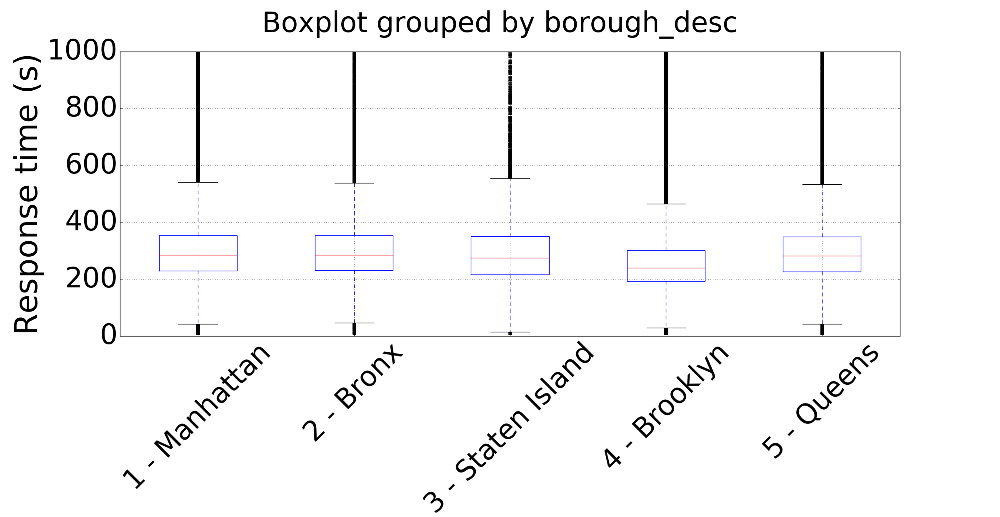

fdny-incident-predictions: Emergency incident prediction
========================================================

In order to improve the efficiency of emergency responders and to enable guided planning of future fire house expansions,
I propose to analyze FDNY data available through NYC's Open Data initiative to predict the likelihood of incidents at a particular
time and location.

The 290 MB of data comprises information pertaining to FDNY incidents between Jan. 2013 and Oct. 2015 taking place in each of the five boroughs of NYC.

Initial analysis
================

I believe the preliminary results shown below already show interesting trends that suggest future areas of analysis. First, we examine when incidents are most likely to occur during the day, based on each borough. Second, we look at the distribution of response times by borough.

Incident time of day
--------------------

Here we look at the time distribution of incidents for each borough. Although at first glance the curves appear to closely match one another, we can see at two distinct trends. First, Staten Island tends to have the highest incident frequency during the evening, while it is less active late at night/early in the morning. On the other hand, the Bronx clearly has a lower incident rate around midday, with higher frequencies at midnight.

Borough response times
----------------------

Now we examine the reponse times (as measured by the elapsed time between the initial call and the emergency provider's arrival time) in each borough. Here we see that median response times in Brooklyn are the fastest among the boroughs, and that their response times are generally quicker than the others. With this knowledge in hand, the obvious question becomes: what makes Brooklyn FDNY more efficient? Perhaps by emulating Brooklyn's strategy we could reduce response times in other boroughs as well.
